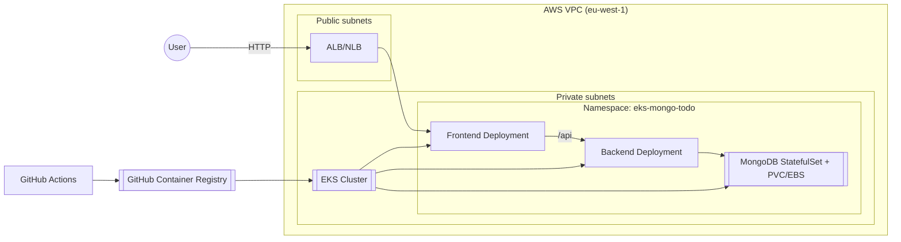

# Arkitekturdiagram

## Systemöversikt

Detta diagram visar den fullständiga arkitekturen för EKS MongoDB Todo-applikationen.

## Komponenter

### Nätverkslager
- **VPC**: Isolerat nätverk i eu-west-1
- **Public Subnets**: 2 subnät i olika AZ för Load Balancer
- **Private Subnets**: 2 subnät i olika AZ för EKS worker nodes
- **Network Load Balancer**: Exponerar applikationen via Ingress

### Kubernetes-kluster
- **EKS Control Plane**: Hanterad av AWS
- **Worker Nodes**: 2x t3.small spot instances
- **Namespace**: eks-mongo-todo (isolerar applikationsresurser)

### Applikationskomponenter
- **Frontend**: React/TypeScript SPA (2 replicas)
- **Backend**: .NET 9 minimal API (2 replicas)
- **MongoDB**: StatefulSet med persistent storage (1 replica)

### CI/CD Pipeline
- **GitHub Actions**: Bygger och pushar Docker images
- **GitHub Container Registry**: Lagrar container images
- **EKS**: Pullar images vid deployment

## Trafikflöde

1. Användare skickar HTTP-request till Load Balancer
2. Load Balancer routar till Ingress Controller (nginx)
3. Ingress routar `/` till Frontend Service
4. Ingress routar `/api` till Backend Service
5. Backend kommunicerar med MongoDB via intern Service
6. MongoDB lagrar data på EBS-volym via PersistentVolumeClaim

## Säkerhet

- **Nätverksisolering**: Private subnets för worker nodes
- **Security Groups**: Kontrollerar trafik mellan komponenter
- **IRSA**: IAM Roles for Service Accounts för EBS CSI driver
- **Secrets**: MongoDB connection string i Kubernetes Secret
- **RBAC**: Rollbaserad åtkomstkontroll i klustret

## Kostnadsoptimering

- Spot instances för worker nodes (~50% rabatt)
- Ingen NAT Gateway (public subnets för nodes)
- Single Network Load Balancer via Ingress
- Minimal node size (t3.small)
- EBS gp3 volumes (kostnadseffektiv storage)

**Total månadskostnad**: ~$100/månad
